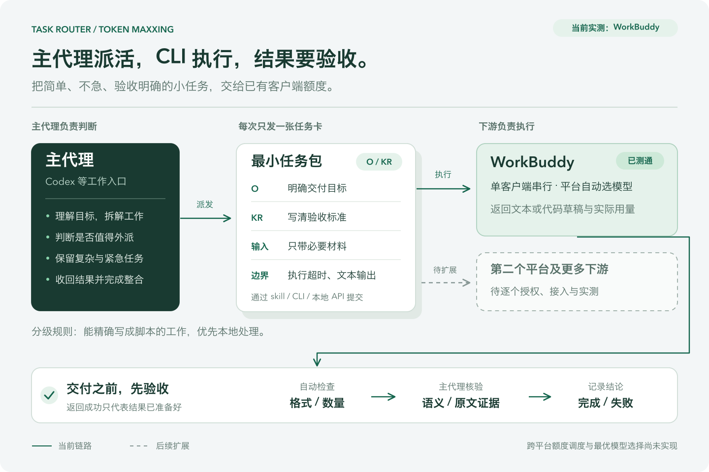

# Task Router · Token Maxxing

**让主代理把合适的小任务交给已有 CLI 额度，并收回可验收的结果。**

你继续在 Codex 等主代理里提出需求。主代理判断哪些工作值得外派，把目标、必要材料和验收要求打成任务包；下游 CLI 执行，主代理检查结果并完成整合。HTML 工作台用于登录入口、连通状态和任务查看，日常派发通过 skill / CLI / 本地 API 完成。

这是 `claude-pm-toolkit` 中的实验方向。目前 **WorkBuddy 单平台链路已实测通过**；跨平台额度调度与“最划算模型”选择仍在规划中。本分支包含独立的 Task Router 代码历史，原工具集保留在 [`main`](https://github.com/peterhuang-coding/claude-pm-toolkit/tree/main)。

[任务目标与 API](docs/task-contract.md) · [分流统计与兜底计划](docs/routing-and-metrics.md) · [运行与开发](docs/development.md) · [验证记录](docs/login-delegation-validation.md) · [任务分级 skill](skills/task-tiering/SKILL.md)

## 如何分工



[查看可放大的 SVG](docs/assets/task-router-overview.svg) · [可编辑图源](docs/assets/README.md) · [任务执行流程图](docs/assets/task-router-lifecycle.png)

例如，开发一个功能时，主代理负责方案、关键代码与整合；反馈分类、材料提取、文案改写等独立批次可以外派。过短的任务可能直接完成更划算，排序、去重等确定性工作优先用脚本。

### 给任务定 OKR，让 CLI 领取任务

| 任务卡 | 含义 | 当前实现 |
|---|---|---|
| 目标 O | 这批工作要产出什么 | `goal` |
| 验收 KR | 数量、字段、来源证据和语义要求 | 要求写入 `goal`；JSON / 数量由服务检查，其余由调用者验收 |
| 输入 | 完成任务必需的材料 | `input_text`；只接受公开或合成材料 |
| 边界 | 允许的工作类型和输出 | 简单、不急、文本或代码草稿；禁用 CLI 工具和 MCP |
| 期限与预算 | 能等多久、值得消耗多少 | 已有执行超时和失败停止；额度硬预算、截止时间调度待实现 |
| 交付 | 结果、用量与验收结论 | 产物、实际模型 / 原生用量、`review` 记录 |

OKR 是任务描述方式；当前没有独立的 `okr` API 字段，也不声称服务能自动判断所有 KR。主代理通过 [skill 和本地 CLI](skills/task-tiering/SKILL.md) 调用，尚未接入 Codex 原生 subagent 接口。

## 产品重点与可复用能力

账号管理、统一接口和低价路由已有开源实现。我们希望把产品重点放在：

1. **在主代理工作中自然派发。** 主代理只打包必要上下文，负责拆解、验收和应用结果。
2. **结合任务期限使用剩余额度。** 让不急的工作等待合适的容量；这一部分还需接入真实额度与多个下游。
3. **按合格交付的成本选择执行器。** 按任务类型积累验收通过率、等待时间和返工成本，用实际结果改进选择；尚未形成充分数据。

以下是截至 2026-09-12 根据项目文档核实的参考，尚未在本机集成或评测：

| 项目 | 可借鉴或复用的部分 |
|---|---|
| [CLIProxyAPI](https://github.com/router-for-me/CLIProxyAPI) | CLI 账号接入与兼容 API |
| [Quotio](https://github.com/nguyenphutrong/quotio) | macOS 账号、额度面板与切换管理 |
| [OmniRoute](https://github.com/diegosouzapw/OmniRoute) | 多提供方网关、额度感知路由与回退 |
| [RouteLLM](https://github.com/lm-sys/RouteLLM) | 将简单请求交给便宜模型的路由与评估 |

这些方向存在重合。任务分级与验收是本项目的产品重点，尚不能称为独有技术或已证明的竞争优势。

## 现在可以做什么

| 能力 | 状态 |
|---|---|
| 10 个网页登录候选入口，另列本机 WorkBuddy | 已实现；登录确认与可调用状态分开 |
| WorkBuddy 随包 CLI → 任务 → 结果 → 验收 | 已实测通过 |
| 单客户端串行、取消、执行超时、重启停止未完成执行 | 已实现 |
| 最小输入、结果 JSON / 数量检查、调用者语义验收 | 已实现 |
| 实际模型及平台报告用量 | 已记录；剩余额度目前未知 |
| 主代理 / 脚本 / 下游的完整分流比例 | 待实现；主代理与脚本尚未统一登记 |
| 其余平台执行器、跨平台最优模型与额度调度 | 待实现 |
| 通用代码编辑、自动应用代码、收费 API 回退 | 待实现；当前只返回文本或代码草稿 |

网页登录候选：Gemini、Kimi、Cursor、OpenCode、GitHub Copilot、Qoder、TRAE SOLO、Qwen、DeepSeek、豆包。**10 个入口不等于 10 个执行器**；网页登录也不等于客户端授权。批量打开受浏览器弹窗策略影响，本次内置浏览器未验证全部十页加载成功，可使用逐页入口。

## 快速开始

当前 WorkBuddy 适配器在 macOS 上验证，依赖已安装且正常登录的 `/Applications/WorkBuddy.app`、Node.js 和 Python 3.12。测试使用 WorkBuddy 5.5.4 与 Node.js 22；客户端更新后需重新核实随包 CLI。无需向 Task Router 提供 API key，客户端自行使用其正常登录状态。

以下命令在新目录安装。若本机已有服务运行，直接打开工作台即可。

```bash
git clone --branch task/login-delegation --single-branch https://github.com/peterhuang-coding/claude-pm-toolkit.git task-router
cd task-router
python3.12 -m venv .venv
source .venv/bin/activate
python -m pip install fastapi==0.115.11 pydantic==2.8.2 uvicorn==0.34.0 httpx==0.27.0
python -m uvicorn taskrouter.main:app --host 127.0.0.1 --port 3459
```

打开 [本地工作台](http://127.0.0.1:3459/dashboard)。没有 WorkBuddy 时也能查看候选入口，但不能执行下游任务。`llm-hub` 仅供旧路由内核读取健康信息，不是 WorkBuddy 链路的必需服务。

在另一个终端进入同一目录并激活虚拟环境：

```bash
python scripts/subagent.py accounts
# 尚未测通时执行短探针；这也会产生一次真实客户端调用。
python scripts/subagent.py probe
# 这个示例含 4 条合成反馈，提交后会使用 WorkBuddy 额度。
python scripts/subagent.py submit --request-file examples/feedback-classification.json
```

保存提交返回的 `id`，用实际 ID 替换下面的 `t_example`：

```bash
python scripts/subagent.py get t_example
# 返回 verifying 后，先检查 result.output 的内容、字段、证据和分类。
python scripts/subagent.py review t_example --passed yes --note '已核验数量、字段、分类与原文证据'
```

验收不通过使用 `--passed no`。取消尚未返回的任务用 `python scripts/subagent.py cancel t_example`。服务只在调用者验收通过后标记 `completed`；相同请求重复提交会创建不同任务，网络不确定时应先查询 [任务列表](http://127.0.0.1:3459/api/subagents)。更多字段、状态和 HTTP 示例见 [任务目标与 API](docs/task-contract.md)。

主代理的分级入口是 [task-tiering](skills/task-tiering/SKILL.md)。本地 CLI 的提交、查询与验收同样可由其他支持命令调用的主代理使用。

## 验证与节省口径

2026-09-12 的一次端到端验收：**8 条合成反馈，8/8 通过，WorkBuddy 执行 11.12 秒**。平台选择 `glm-5.3`，报告输入 3367、输出 365、原生 credit 0.74；待验收及完成后重启均没有重跑。相关版本的 52 项测试通过。完整范围见 [验证记录](docs/login-delegation-validation.md)。

这证明单平台链路可用，尚未证明总体节省比例。主模型用量、下游额度、额外付费和用户等待时间需要分别统计；不同平台的 token / credit 不直接相加。比较时以同一批任务、相同验收要求为基准，把打包、失败、重试和主代理验收的开销计入每个合格任务的成本。

当前可核验 3 次合成批次执行（2 次手动 CLI、1 次统一派发），没有已登记的真实业务批次。它们只能说明测试范围，不能算出整体外派比例。统计分母、选择优先级和 TeleAgent 候选的边界见 [分流统计与兜底计划](docs/routing-and-metrics.md)。

## 下一步

- [x] WorkBuddy 单平台派发与验收、HTML 工作台、本地 API / CLI、分级 skill。
- [ ] 先补主代理 / 本地脚本 / 下游的分级登记与次数统计，测试、探针、重试分别记录。
- [ ] 验证第二个下游：TeleAgent 是研究候选，先核实外部执行入口，再比较同组任务。
- [ ] 加入可解释的执行器顺序与有上限的回退；当前仅由 skill 约定失败后交回主代理。
- [ ] 接入真实额度和重置时间，让非紧急任务按期限排队。
- [ ] 建立按任务类型的质量 / 成本记录，再决定扩展平台与接入层复用方案。

原任务内核、运维和开发说明见 [运行与开发](docs/development.md)。历史 [PRD](docs/prd.md) 与 [早期设计](docs/superpowers/specs/2026-09-11-tokenmaxxing-design.md) 保留演进背景；当前能力以本文及代码为准。
