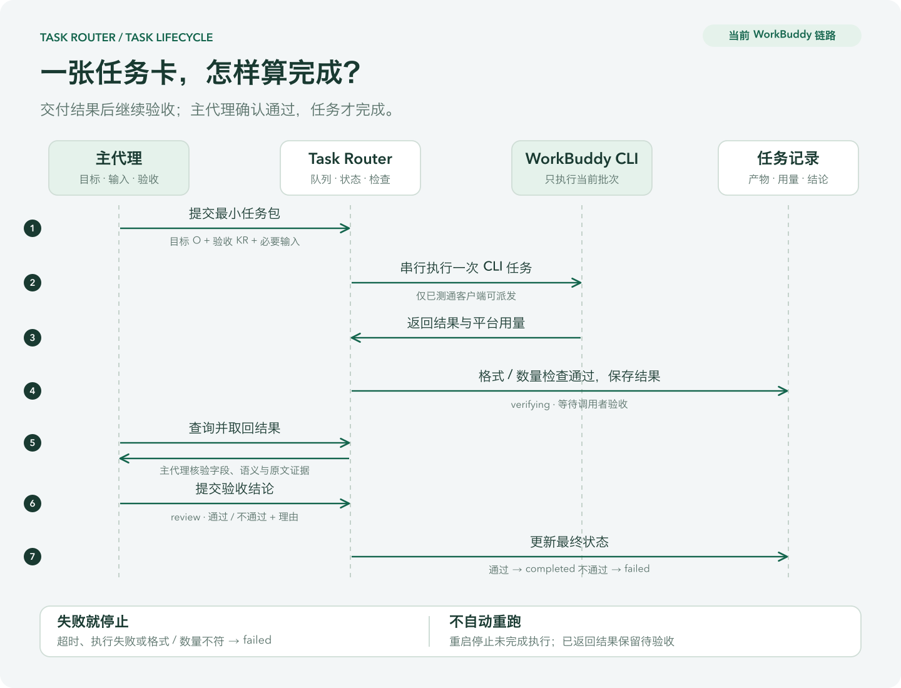

# 任务目标、验收与本地 API

本页对应 `/api/subagents` 客户端派发链路。主代理制定目标和验收标准，CLI 承接一批边界明确的工作；平台可以替换，任务的成功标准应保持一致。当前执行器只有 WorkBuddy。



[查看可放大的 SVG](assets/task-router-lifecycle.svg) · [Mermaid 结构图源](assets/task-router-lifecycle.mmd)

## 用 OKR 表达一批任务

- **O：交付目标。** 例如把反馈整理成分类数据，供后续产品分析使用。
- **KR：可检查的结果。** 输入输出一一对应、类别符合规则、证据来自原文、字段完整。
- **约束：** 提供哪些材料、能等待多久、允许哪些操作。
- **交付与验收：** 保存结果和实际用量，调用者检查后提交通过或失败。

目标和语义 KR 目前一起写在 `goal` 中。格式、数组数量由服务检查，字段、顺序、分类和证据由调用者核验。系统记录调用者的验收结论，不独立证明该结论正确。

## 当前请求格式

可直接运行的请求见 [4 条合成反馈示例](../examples/feedback-classification.json)。

| 字段 | 类型与默认值 | 当前行为 |
|---|---|---|
| `goal` | 必填字符串，1–8000 字符 | 目标及验收要求；不能全为空白 |
| `input_text` | 必填字符串，1–80000 字符 | 最小材料包；不能全为空白。嵌入 JSON 时也须编码成字符串 |
| `output_format` | `text` / `json`，默认 `text` | JSON 输出须可解析 |
| `expected_count` | 可选整数，0–5000 | 仅支持 JSON 输出；要求结果为对应长度的数组 |
| `complexity` | `simple` / `moderate` / `complex`，默认 `simple` | 当前仅允许 `simple` 派发 |
| `urgency` | `flexible` / `urgent`，默认 `flexible` | 当前仅允许 `flexible` 派发 |
| `data_sensitivity` | `public` / `synthetic` / `confidential`，默认 `public` | 当前拒绝 `confidential` |
| `timeout_seconds` | 整数，10–300，默认 120 | 限制实际 CLI 执行时间，不包括排队和验收 |

难度、紧急程度和数据类别由调用者提供；服务检查标签，不会自动分析材料并重新分级。主代理应先判断任务是否适合外派，尤其不要把机密或个人材料标成公开输入。

没有独立的 `okr`、`key_results`、`provider`、`model`、`deadline`、`max_cost`、`max_retries` 或 `local_only` 字段。未知字段返回 422，不会静默忽略。额度硬预算、跨平台选择和截止时间调度属于后续能力；WorkBuddy 当前沿用平台自动选模型并记录实际模型。

## 主代理调用顺序

1. 判断一次：确定性处理用本地脚本；很短、复杂或紧急的任务由主代理完成；简单、不急、公开或合成批次才考虑下游。不为分级额外启动一个模型。
2. 用 `accounts` 检查可用性。`login_reported` 只表示本人确认登录；只有 `routable=true` 表示已安装且曾通过连通探针，实际派发仍可能因后续额度 / 登录变化失败。
3. 将最小任务包保存为 JSON，用 `submit` 提交并保存返回的任务 ID。不传完整主对话、无关文件或凭证。
4. 用 `get` 轮询；`verifying` 表示已有结果，读取 `result.output` 并核验。
5. 用 `review --passed yes/no` 留下验收结论与理由。通过后才进入 `completed`。

这个示例的独立验收预期为：F01 → bug、F02 → feature、F03 → question、F04 → praise。检查每项恰含 `id`、`category`、`evidence`，ID 顺序与输入一致，且非空 evidence 是对应 text 的连续原文。验收标准放在调用者一侧，不把标准答案追加进下游输入。

失败不会自动重试或切换到收费 API。调用者最多做一次有针对性的修正需要重新建任务，这属于 skill 的执行约定，不是服务的跨任务限次机制。取消未返回任务用 `cancel`；已进入 `verifying` 的结果应通过验收接口处理。

## 状态与结果

正常状态链路为：

```text
queued → preparing-context → routing → running → verifying → completed
                                                  └─ 验收不通过 → failed
```

执行超时或失败进入 `failed`；主动取消可进入 `cancelled`。服务重启会将仍在排队或执行中的本链路任务标为失败，避免自动再次消耗额度；已进入 `verifying` 的结果保留待验收，已完成结果也保留。该恢复行为与旧通用路由内核分开处理。

任务详情包含：

| 内容 | 位置 |
|---|---|
| ID、状态和目标 | 顶层 `id`、`status`、`goal` |
| 是否需要验收 | `review_required` |
| 已解析 JSON 或文本 | `result.output`；结果尚未返回时 `result` 为 null |
| 实际执行器 | `result.provider` |
| 执行时长和平台报告用量 | `result.metadata`，包括 `elapsed_seconds`、`usage`、`models` 等 |
| 自动格式 / 数量检查 | `result.checks` |
| 验收结论 | `evaluations`、`result.semantic_review` |

用量以平台实际返回为准，可能为空或缺少某些指标。`quota_remaining` 当前为 null；`total_cost_usd_reported=0` 不代表没有消耗客户端额度。失败调用目前未形成完整的跨平台成本账本。

## HTTP 接口

开发服务默认在 `http://127.0.0.1:3459`，完整 OpenAPI 位于 `/docs`。下面是本链路的接口：

| 方法 | 路径 | 用途 |
|---|---|---|
| GET | `/api/accounts` | 候选平台、本人登录标记和连通状态 |
| POST | `/api/accounts/{id}/login` | 保存本人确认，JSON 为 `{"logged_in": true}`；不代替客户端授权 |
| POST | `/api/accounts/workbuddy/probe` | 执行一次最长 60 秒的短探针，会调用真实客户端 |
| POST | `/api/subagents` | 提交请求，成功返回 202 和任务记录 |
| GET | `/api/subagents` | 最近 50 条任务 |
| GET | `/api/subagents/{id}` | 状态、结果和验收记录 |
| POST | `/api/subagents/{id}/review` | `{"passed": true, "note": "核验说明"}`，note 最长 1000 字符 |
| POST | `/api/subagents/{id}/cancel` | 取消尚未返回的任务 |

所有上述 POST 请求要求 `X-TaskRouter-Local: 1`。若存在 `Origin`，必须与本地服务地址同源；不支持跨站写入。这个请求头用于限制浏览器跨站请求，不是面向互联网的身份认证。服务按单用户本机用途运行并绑定回环地址。

```bash
curl --noproxy '*' -sS http://127.0.0.1:3459/api/subagents \
  -H 'Content-Type: application/json' \
  -H 'X-TaskRouter-Local: 1' \
  --data-binary @examples/feedback-classification.json
```

常见响应：403 表示缺少本地请求头或跨站写入；404 表示未知任务 / 平台；409 表示暂不可派发、探针占用、队列已满或状态不允许操作；422 表示请求字段不合法；探针失败返回 502。

CLI 的 `--url` 放在子命令之前，例如 `python scripts/subagent.py --url http://127.0.0.1:3459 accounts`。CLI 只支持本地 HTTP 地址并绕过环境中的 HTTP 代理。

## 重复提交与数据边界

同样的 HTTP 请求提交两次会产生两个任务，当前没有请求幂等键。网络返回不确定时，先查任务列表，避免盲目重发。单个 WorkBuddy 客户端串行执行；排队与运行中的任务总数上限为 20。

客户端使用临时工作目录、stdin 输入，并关闭工具与 MCP。原文任务包、返回结果和验收记录保存在本机运行目录；公开或合成输入仍会发送给 WorkBuddy 服务完成推理。Task Router 不接管浏览器 cookie 或客户端登录凭据，也不通过该链路读取 API key。
